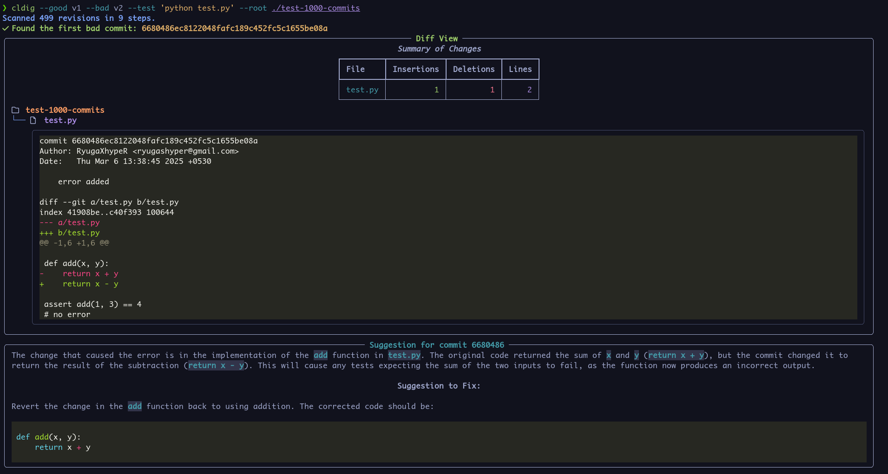

cldig
=====

A CLI tool to pin point change that caused degradtion and recommend suggestions to fix them.

Install
-------

To install, clone the repo and install with pip.

.. code:: bash

   git clone https://github.com/RyugaXhypeR/cldig
   cd cldig
   pip install -e .

This will install `cldig` as an executable.

Usage
-----

To get started checkout the help command

.. code:: bash

   cldig --help

.. note::

   To get the LLM suggestions, you need to have ``OPENAI_API_KEY`` environment variable set.
